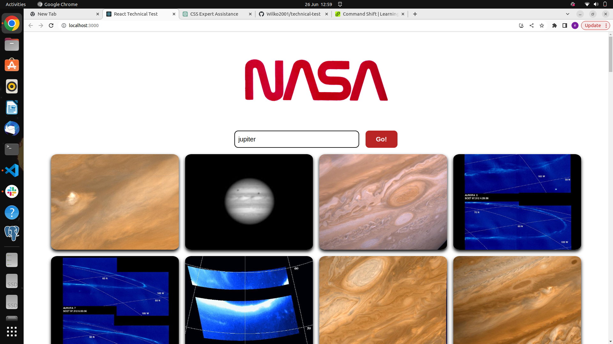

# Nasa image search engine.

## description

In this app we made a search engine that uploaded Nasa images to a browser when searched. We needed to render the images from an API and ensure the search input located specific images from this. For example, searching 'moon' would show all the images relating to the moon.

## Images of the app

### Built with

- React

### Testing utilities

- Jest
- React Testing Library

### Packages used

- Axios

### Instructions for use

Search for any Nasa image you would like to look at using the search bar, the app will then load any relevant images related to your search.

### features

This app has a user-friendly interfact that allows you to search for Nasa images via an API.

Once you search for a particular image, all images will be located that relate to your search input. However, if you search for something and nothing is located a message will appear that states there is 'no results'.

### Things I would like to add if I had more time

If I had more time to spend on this app, I would like to add more styling to make the app more visually appealing. I would add to the top of the app where there is a lot of space, a few little icons that would have some animations to make the site more interactive.

I would additionally add a bar that had suggested searches, so users could have a clearer idea of what they can search for here or what the popular searches are.

I nice idea would be to add a filter on this search engine, this could make the site more user friendly, and make it easier for people to search via different categories. For example, there could be a galaxy section, this would include the names of different galaxies. This could be useful as people likely don't know the name of each one.

Finally, I could add an information secition for each image which would be informative for the user, and they would have a clearer idea of what that particular image is showing.

### Author

Emma Wilkinson
